# Nagrik (નાગરિક) — Comprehensive System Architecture Documentation

This document provides an in-depth technical architecture blueprint of the **Nagrik** platform — Gujarat's Family ID & Proactive Welfare Orchestration System.

---

## 1. System Architecture Diagram (Mermaid `architecture-beta`)

---

## 2. In-Depth Component Diagram (Mermaid `flowchart TB`)

```mermaid
flowchart TB
    subgraph PRESENTATION["1. CLIENT PRESENTATION LAYER"]
        direction LR
        subgraph CITIZEN_PORTAL["Citizen Web App (user_frontend)"]
            CP1["React 19 + Vite + TanStack Query"]
            CP2["Bilingual UI: English / ગુજરાતી (i18next)"]
            CP3["Analyze My Family 360° Command Center"]
            CP4["Scheme Differentiator (100% vs 58% Opacity)"]
            CP5["Interactive Hover Eligibility Tooltip"]
            CP6["Fast Filter: [All] [Eligible] [Other]"]
        end
        subgraph ADMIN_PORTAL["Admin & Officer Portal (admin_frontend)"]
            AP1["React 19 + Vite + React Hook Form + Zod"]
            AP2["Scheme Saturation Funnel Dashboard"]
            AP3["Beneficiary Discovery Directory & 1-Click Nudge"]
            AP4["Milestone Cron Trigger Button"]
            AP5["3-Tier Application Review Queue"]
            AP6["360° Family Welfare Case Inspector"]
        end
    end

    subgraph API_GATEWAY["2. API & SECURITY GATEWAY (Render Cloud)"]
        direction TB
        GW1["Trust Proxy & SSL/TLS Termination"]
        GW2["Helmet Security Headers & CORS Policy (*.vercel.app)"]
        GW3["Rate Limiting (1,000 - 2,000 req / 15m)"]
        GW4["JWT Bearer Authentication & RBAC Guard"]
        GW5["Roles: Citizen | Talati (L1) | Mamlatdar (L2) | DistrictOfficer (L3) | Admin"]
    end

    subgraph BACKEND_SERVICES["3. CORE DOMAIN CONTROLLERS (Express.js)"]
        direction TB
        C1["schemeController.js<br/>• listSchemes<br/>• getSchemeBeneficiaries<br/>• nudgeBeneficiary<br/>• triggerSchemeCron"]
        C2["familyController.js<br/>• registerFamily<br/>• addFamilyMember<br/>• updateMemberProfile<br/>• updateMemberStatus"]
        C3["applicationController.js<br/>• submitApplication<br/>• getApplicationQueue<br/>• decide (3-Tier Approval)"]
        C4["v2WelfareController.js<br/>• analyzeFamily<br/>• getBenefitGraph<br/>• simulateLifeEvent"]
    end

    subgraph INTELLIGENCE_LAYER["4. WELFARE INTELLIGENCE & ORCHESTRATION ENGINE"]
        direction TB
        S1["eligibilityEngine.js<br/>Deterministic Rules Engine: Age, Income, BPL, Category, Ration, Marital, Disability, Student"]
        S2["saturationAnalyticsService.js<br/>Total Eligible Pool, Active Enrolled %, In-Review, Coverage Gap % & Proactive Nudging"]
        S3["lifecycleTriggerService.js<br/>Real-Time Family Mutations: Birth, Death, Marriage, Income Revision ➔ Auto-Notifications"]
        S4["cronService.js<br/>Scheduled 12h Cron & On-Demand Engine: Age Milestones (Turned 60/18), Expiring Certificates"]
        S5["familyBenefitGraphService.js<br/>Multi-Hop Traversals: Family ➔ Members ➔ Events ➔ Evidence ➔ Schemes ➔ Benefits"]
        S6["benefitGapDetector.js<br/>Coverage % Score, Potential Benefits, Unclaimed Annual Value"]
        S7["reusableEvidenceService.js<br/>Upload Once, Validate Across Multiple Departmental Schemes"]
    end

    subgraph INTEROPERABILITY_LAYER["5. GOVERNMENT DATA CONNECTORS (SIMULATED / INTEROPERABLE)"]
        direction LR
        INT1["Civil Registration (CRS)<br/>Birth / Death Verification"]
        INT2["Food Security (NFSA)<br/>Ration Quota & BPL Tiers"]
        INT3["Education (U-DISE+)<br/>Enrollment & Scholarships"]
        INT4["NSAP Portal<br/>Central Pension Sync"]
        INT5["DigiLocker<br/>Certificate Verification"]
    end

    subgraph DATA_PERSISTENCE["6. PERSISTENCE & CRYPTOGRAPHIC VAULT (MongoDB Atlas)"]
        direction TB
        DB1[("Families<br/>(Family ID, Head, Annual Income, Category, BPL, Ration Type)")]
        DB2[("Members<br/>(Member ID, DOB, Gender, Marital Status, Disability, Student)")]
        DB3[("Schemes<br/>(20 Gujarat Schemes, Deterministic Rules, Required Docs)")]
        DB4[("Applications<br/>(Multi-Level Status: Pending ➔ Level1 ➔ Level2 ➔ FinalApproved)")]
        DB5[("BenefitEntitlements<br/>(Sanctioned Amount, Frequency, Disbursement Status)")]
        DB6[("LifeEvents & OfficerTasks<br/>(Birth, Bereavement, Verification Checklist)")]
        DB7[("Notifications<br/>(Proactive Alerts, Nudges, Milestone Announcements)")]
        DB8[("AuditLogs<br/>(Immutable, Append-Only Tamper-Evident Trail)")]
        CRYPTO["AES-256-GCM Encryption Vault<br/>(Aadhaar Vault with IV & Auth Tag)"]
    end

    %% Connections
    PRESENTATION --> API_GATEWAY
    API_GATEWAY --> BACKEND_SERVICES
    BACKEND_SERVICES --> INTELLIGENCE_LAYER
    INTELLIGENCE_LAYER --> INTEROPERABILITY_LAYER
    BACKEND_SERVICES --> DATA_PERSISTENCE
    INTELLIGENCE_LAYER --> DATA_PERSISTENCE
    C2 -. Encrypts / Decrypts Aadhaar .-> CRYPTO
```

---

## 3. Layer-by-Layer Technical Specification

### Layer 1: Presentation & Frontends
- **Citizen Portal (`user_frontend`)**:
  - **Framework**: React 19, Vite, TanStack Query v5, React Router DOM v7.
  - **Internationalization**: `react-i18next` with complete English and Gujarati (ગુજરાતી) dictionaries.
  - **State Management**: Zustand for authentication state (`authStore.js`).
  - **Styling**: Vanilla CSS Design System with custom design tokens (`index.css`), fluid layouts, and zero external CSS bloat.
  - **UX Features**:
    - **Visual Scheme Differentiator**: 100% full opacity for qualifying schemes with green glow badges; 58% low opacity with grayscale tone for ineligible schemes.
    - **Hover Tooltip Explanations**: Smooth card expansion revealing exact failed criteria (e.g. income limit exceeded, minimum age 60 required).
    - **Quick Filter Pills**: Instant one-click toggle: `[All Schemes]`, `[✨ Eligible for My Family]`, `[Other Schemes]`.
    - **"Analyze My Family" Command Center**: Complete single-click household welfare audit displaying coverage score and unclaimed annual value.

- **Admin & Saturation Portal (`admin_frontend`)**:
  - **Framework**: React 19, Vite, TanStack Query v5, React Hook Form, Zod schema validation, Recharts.
  - **Role-Based Views**: Automatically adapts navigation and action privileges based on officer role (`Talati`, `Mamlatdar`, `DistrictOfficer`, `Admin`).
  - **Saturation Board**:
    - Funnel metrics: Eligible Household Pool, Active Enrolled %, In-Flight Applications, Unreached Coverage Gap.
    - Beneficiary table with real-time status: `🔴 Not Applied`, `🟡 In Review`, `🟢 Enrolled`.
    - 1-Click Proactive Nudge: Sends immediate in-app alerts to unreached citizens.
    - Milestone Cron Recalculation: On-demand live eligibility evaluation across Gujarat.

---

### Layer 2: API Gateway & Security Perimeter
- **Platform**: Render Cloud Web Service (`https://nagrik-backend-iz5j.onrender.com`).
- **Security Policies**:
  - `app.set('trust proxy', 1)`: Accurate IP detection behind Render reverse proxies.
  - `helmet`: Strict HTTP Content Security Policy, Cross-Origin-Resource-Policy, and anti-sniffing protections.
  - `cors`: Explicit whitelist permitting Vercel deployments (`*.vercel.app`) and local development ports.
  - `express-rate-limit`: Global API rate limiting (1,000 requests per 15-minute window for authenticated users, 2,000 for development).
  - `authMiddleware` & `roleMiddleware`: Cryptographic JWT Bearer token validation with strict role boundaries.

---

### Layer 3: Backend Domain Controllers
- Located in `backend/src/controllers/`:
  - **`schemeController.js`**: Scheme CRUD, state-wide saturation queries (`getSchemeBeneficiaries`), citizen nudging (`nudgeBeneficiary`), and cron evaluation (`triggerSchemeCron`).
  - **`familyController.js`**: Household registration, member roster mutations, profile revisions, and lifecycle status changes.
  - **`applicationController.js`**: Multi-tier application submission, role-specific queues, automated checklist evaluations, and 3-tier approval decisions.
  - **`eligibilityController.js`**: Family-level and member-level explainable eligibility evaluations.
  - **`v2WelfareController.js`**: Welfare intelligence endpoints (`analyzeFamily`, `getFamilyGraph`, `simulateLifeEvent`, `verifyLifeEvent`).

---

### Layer 4: Welfare Intelligence & Orchestration Engine
- Located in `backend/src/services/`:
  - **`eligibilityEngine.js`**: Deterministic rule evaluator checking 8 socio-economic vectors (Age ceiling/floor, Annual Income, BPL status, Reservation Category, NFSA Ration Tier, Marital Status, Registered Disability, Enrolled Student status). Returns explainable `satisfiedRules`, `failedRules`, `why`, and `nextActions`.
  - **`saturationAnalyticsService.js`**: Computes state-wide and district saturation metrics, compares current entitlements vs in-flight applications, and identifies unreached eligible citizens.
  - **`lifecycleTriggerService.js`**: Listens for family mutations (Birth, Death, Marriage, Income changes), evaluates newly unlocked schemes, dispatches citizen notifications, and suspends invalid benefits.
  - **`cronService.js`**: Autonomous 12-hour scheduler and on-demand trigger checking for milestone birthdays (turning 60, turning 18), certificate expirations, and saturation updates.
  - **`familyBenefitGraphService.js`**: Graph traversal engine building complete 360° entity graphs (`Family` ➔ `Members` ➔ `Events` ➔ `Evidence` ➔ `Schemes` ➔ `Benefits` ➔ `Risks` ➔ `Tasks`).
  - **`benefitGapDetector.js`**: Identifies welfare coverage score %, unreached financial value, and prioritized recommendations.
  - **`reusableEvidenceService.js`**: Single document upload registry powering "upload once, verify everywhere" across government departments.

---

### Layer 5: Government Data Connectors
- Located in `backend/src/integrations/`:
  - **`CivilRegistrationConnector.js`**: Simulates integration with Gujarat Civil Registration System for authoritative birth/death verification.
  - **`GovernmentDataConnector.js`**: Simulates pan-India public registries (UIDAI Aadhaar, NFSA PDS ration database, U-DISE+ educational registry, NSAP pension database, and DigiLocker).
  - All connectors maintain deterministic simulation responses clearly tagged with source attribution.

---

### Layer 6: Persistence & Cryptographic Vault
- **Database**: MongoDB Atlas cloud cluster with optimized compound indices on `familyId`, `memberId`, `schemeCode`, and `status`.
- **Aadhaar Cryptographic Vault (`encryption.js`)**:
  - Algorithm: **AES-256-GCM** authenticated symmetric encryption.
  - Never stores plain-text 12-digit Aadhaar numbers. Stores `encryptedAadhaar`, unique 16-byte initialization vector (`iv`), and 16-byte authentication tag (`authTag`).
  - Provides masked display outputs (e.g. `XXXX-XXXX-1234`).
- **Immutable Audit Trail (`AuditLog.js` & `auditLogService.js`)**:
  - Append-only collection recording actor ID, role, action, entity type, and before/after snapshot differentials.
  - Prohibits updates or deletions to preserve tamper-evident administrative accountability.
